| Author                 | Date         | Version |
| ---------------------- | ------------ | ------- |
| Ranielle Lloyd B. Cruz | June 3, 2024 | v1.0.0  |

## Condo Rental Web Design
This project is a basic frontend for a condominium rental website made with VueJS, Laravel, and Bootstrap. It is currently a work-in-progress project. It provides a user-friendly interface for potential tenants to explore available rental units, view property details, and contact the rental management team.

### Homepage
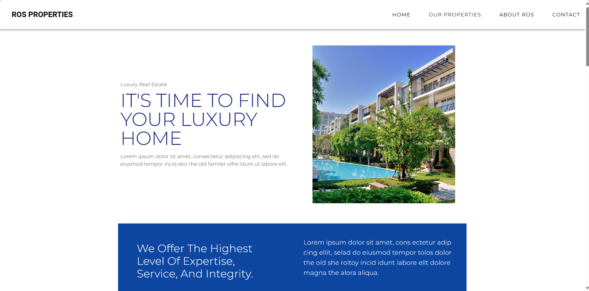

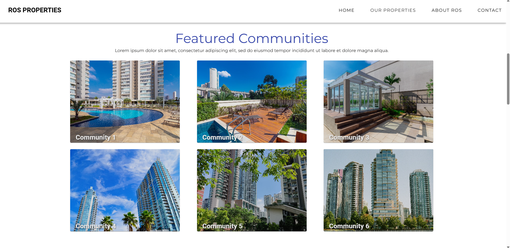
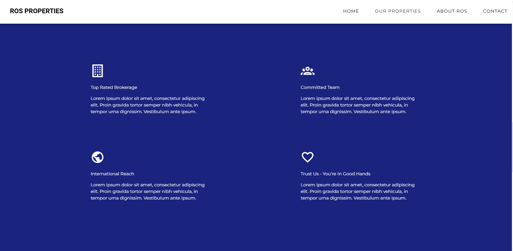
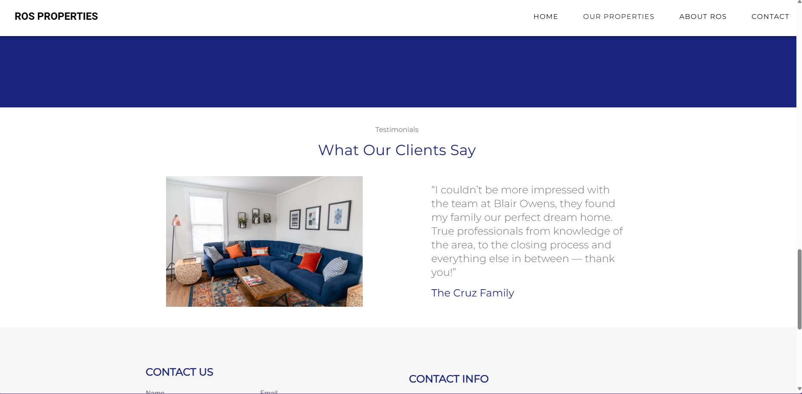
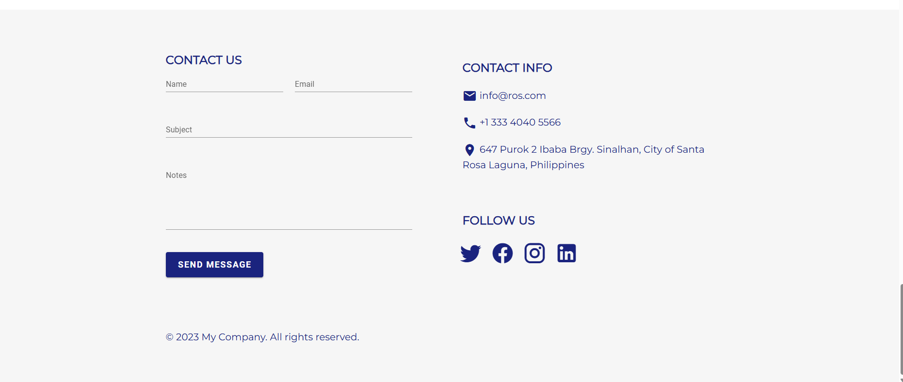

### Exclusive Listings
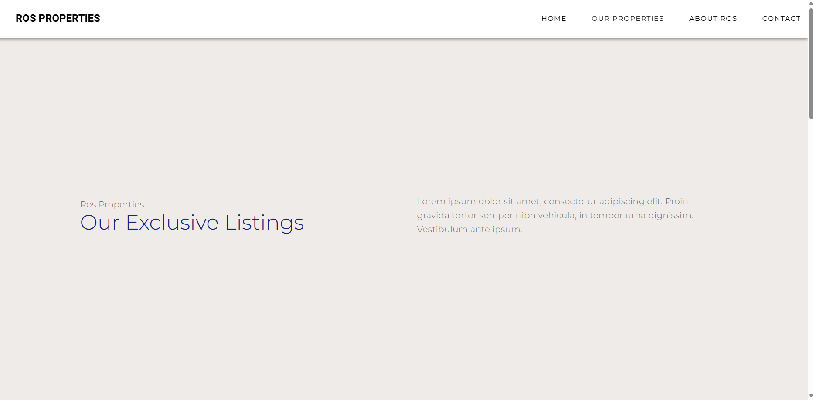
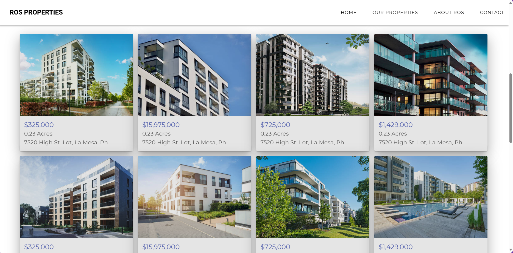
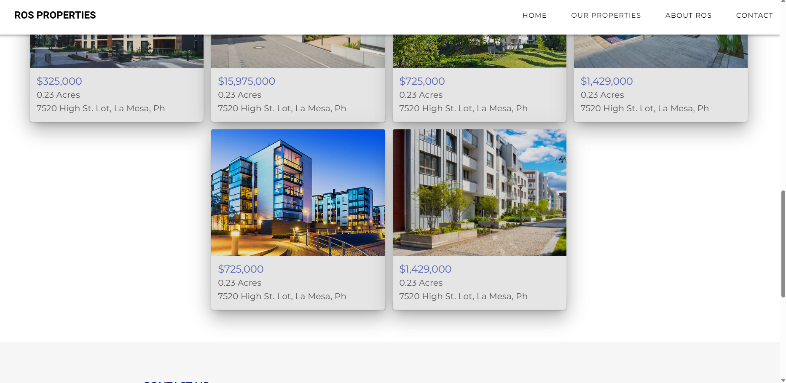
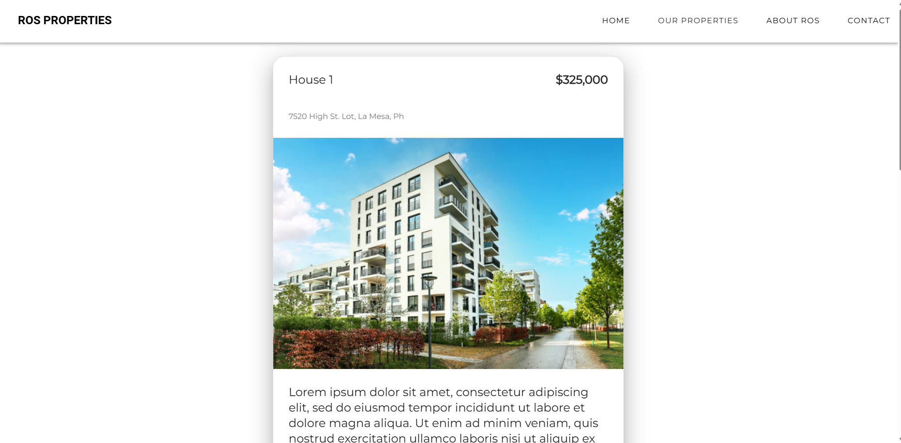
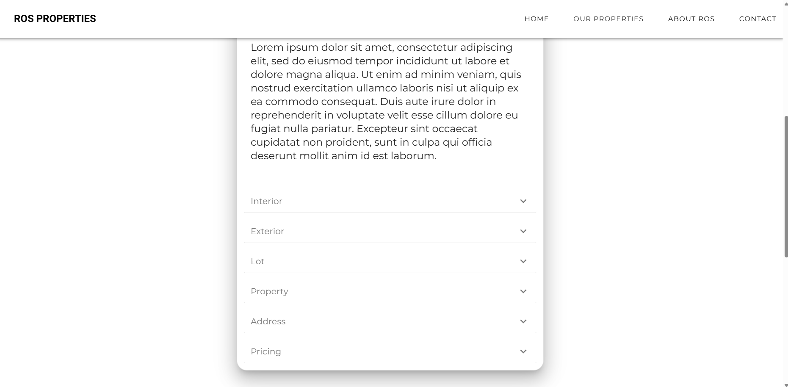
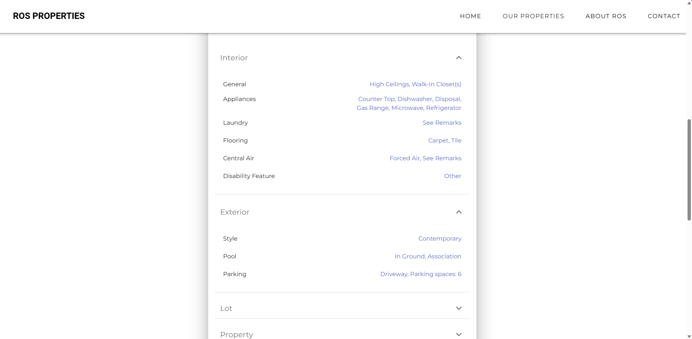

### About
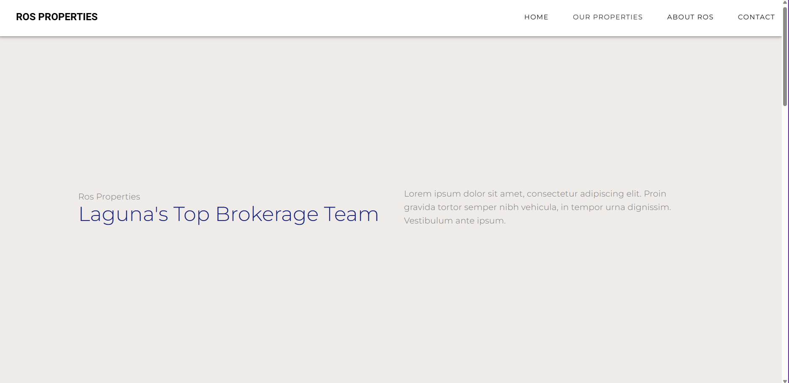
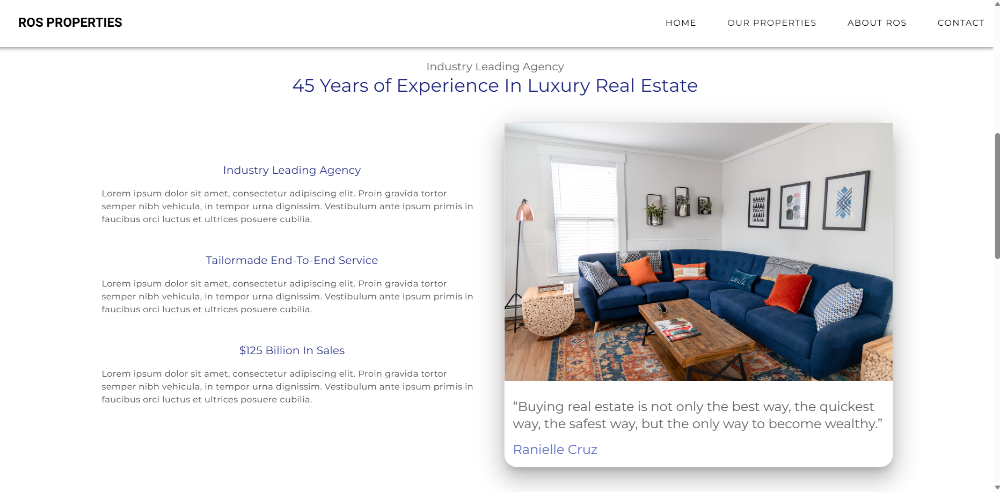
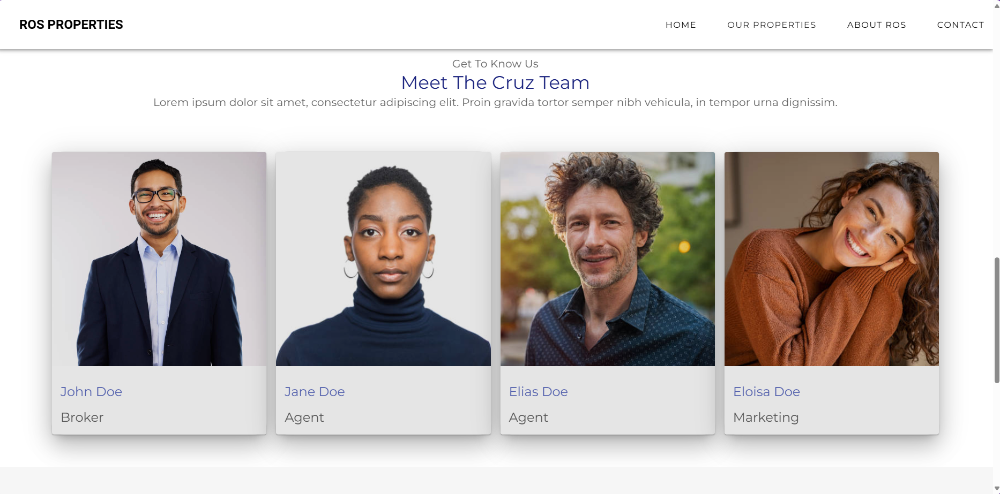

### Open Houses
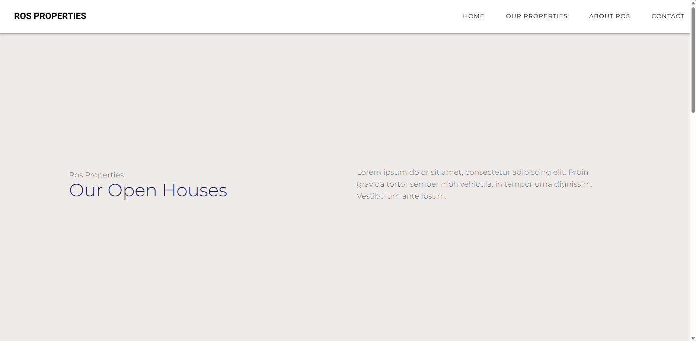

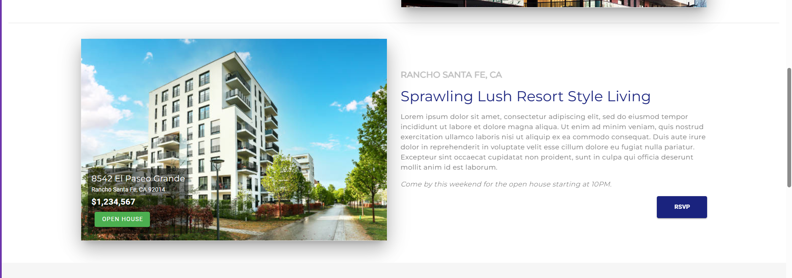

### Sold Listings
TBA

## Installing Laravel-Vue

### pre-requites

-node js
-composer
-Vue Language(Volar) extension on visual studio code
-php version 8.1

## run the following commands:

1. create a laravel project
   command: `composer create-project laravel/laravel:^9.0 condo-ui-app`

Note: "^9.0" stands for that version, because we'll be utilizing Laravel version 9
and "condo-ui-app" stands for the project folder name.

2. command: cd condo-ui-app

3. Install laravel-ui package

command: `composer require laravel/ui`

4. Install the frond-end scaffolding using artisan command

command: `php artisan ui vue`

Note: Make sure to add .vue() to the webpack.mix file, which you can find inside your Laravel project, before moving on to step 5.

This is how to be happen under the file webpack.mix:

```javascript
const mix = require("laravel-mix");

/*
 |--------------------------------------------------------------------------
 | Mix Asset Management
 |--------------------------------------------------------------------------
 |
 | Mix provides a clean, fluent API for defining some Webpack build steps
 | for your Laravel applications. By default, we are compiling the CSS
 | file for the application as well as bundling up all the JS files.
 |
 */

mix.js("resources/js/app.js", "public/js")
    .vue()
    .postCss("resources/css/app.css", "public/css", [
        //
    ]);
```

Note: by adding .vue() on webpack.mix is to avoid error about "ERROR in ./resources/js/components/ExampleComponent.vue 1:0
Module parse failed: Unexpected token (1:0)" 5. Install vue3 and Compile your Fresh Scaffolding

command: `npm install && nmp run dev`

6. Update the vue-loader

command: `npm update vue-loader`

We need to update the vue-loader to avoid this error "[webpack-cli] Error: Cannot find module 'webpack/lib/rules/DescriptionDataMatcherRulePlugin'
Require stack:" while running the command the npm run watch

7. install vue-router

command: `npm install vue-router`

Note: vue-router is need for routing the intergated laravel-vue modules/webpages

You can installed other dependecies your need on vue3

8. Add a vue components under the resources/js/components for example Home.vue and under the Home.vue add this code

9. Install Vuetify
   command: `npm install vuetify`

```vue
<template>
    <div>Hello World Happy Installation of Laravel9-Vue3</div>
</template>

<script>
export default {
    mounted() {
        document.title = "Home";
    },
};
</script>
```

9. Under the app.js on resources/js replace the code by this:

```javascript
require("./bootstrap");

import { createApp } from "vue";
import Home from "./components/Home.vue";
import routes from "./routes.js";

const app = createApp({});

app.component("home", Home);

app.use(routes);
app.mount("#app");
```

10. Make a file under the resources/js with the name of routes.js and add this code:

```javascript
import { createWebHistory, createRouter } from "vue-router";
import Home from "./components/Home.vue";

const routes = [
    {
        path: "/",
        name: "home",
        component: Home,
    },
];

const router = createRouter({
    history: createWebHistory(),
    routes,
});

export default router;
```

11. Next, make a blade file under the resources/views with the name of file home.blade.php and add this code:

```blade
<!DOCTYPE html>
<html lang="en">
<head>
    <meta charset="UTF-8">
    <meta name="viewport" content="width=device-width, initial-scale=1.0">
    <meta http-equiv="X-UA-Compatible" content="ie=edge">
</head>
<body>
    <div id="app">
        <div>
          <home/>
        </div>
    </div>

    <script src="{{ mix('js/app.js') }}"></script>
</body>
</html>
```

12. Under routes folder, replace the code Route::get of routing on web.php

From this,

```php
Route::get('/', function () {
    return view('welcome');
});
```

to this,

```php
Route::get('/{any?}', [
    function () {
    return view('home');}
])->where('any','.*');

```

13. on a seperate command run php artisan serve

14. on a seperate command npm run watch

Note: npm run watch is need to automatically compile all the changes on your Vue components and assets during development.

## Cloning

### Pre-Requisite

-JSON-RPC
-PHP VErsion 8.1

## Installing JSON-RPC

1. Install Guzzle HTTP client:

`composer require guzzlehttp/guzzle`

## Cloning process

1. clone the project using this command:

`git clone https://github.com/Reynyel/condo-ui-app.git`

2. After cloning check the project file and find the .env.examples change the name of that file

from .env.examples to .env

3. `git checkout dev`

4. `git pull`

5. run the command on the root project folder this:

`composer install`

6. After the installation run this command

`npm install`

7. After installing the composer and npm, run those two command:

On a seperate command run this:

`php artisan serve`

On the other side, run this

`npm run watch`

8. After running those two command, try to open the url localhost://8000

note: You will get an error abaout generate key, click generate key then you will see a button refresh click refresh and automatically you can now browse the project in your local machine.

## Other packages

### Webfont - Material Design Icons

`npm install @mdi/font`

### @jamescoyle/vue-icon

`npm install @jamescoyle/vue-icon`
